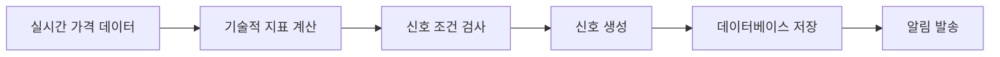
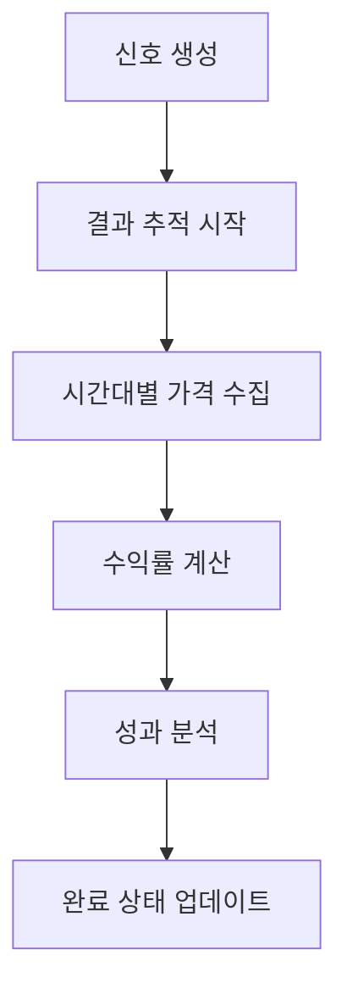
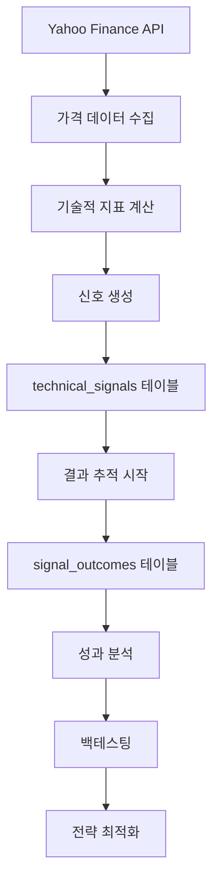

# 🚀 Finstage Market Data - 고급 기능 가이드

## 📋 목차

1. [시스템 개요](#시스템-개요)
2. [Phase 1: 기본 기술적 분석](#phase-1-기본-기술적-분석)
3. [Phase 2: 결과 추적 시스템](#phase-2-결과-추적-시스템)
4. [Phase 3: 고급 분석 기능](#phase-3-고급-분석-기능)
5. [백테스팅 시스템](#백테스팅-시스템)
6. [스케줄링 시스템](#스케줄링-시스템)
7. [데이터 플로우](#데이터-플로우)
8. [사용법 가이드](#사용법-가이드)

---

## 🎯 시스템 개요

Finstage Market Data는 3단계로 구성된 종합적인 기술적 분석 및 백테스팅 플랫폼입니다.

### 🏗️ 아키텍처 구조

```
📊 데이터 수집 → 🔍 기술적 분석 → 📈 결과 추적 → 🧠 고급 분석 → 💰 백테스팅
```

### 📁 주요 컴포넌트

- **기술적 분석 엔진**: 20+ 기술적 지표 실시간 모니터링
- **결과 추적 시스템**: 신호 발생 후 성과 자동 추적
- **백테스팅 엔진**: 과거 데이터 기반 전략 검증
- **고급 패턴 분석**: 머신러닝 기반 패턴 인식
- **포트폴리오 최적화**: 다중 전략 조합 분석

---

## 🔧 Phase 1: 기본 기술적 분석

### 📊 지원 지표

| 지표 유형       | 구체적 지표       | 설명                         |
| --------------- | ----------------- | ---------------------------- |
| **이동평균**    | MA50, MA200       | 50일/200일 이동평균선 돌파   |
| **RSI**         | RSI(14)           | 과매수(70↑)/과매도(30↓) 신호 |
| **볼린저 밴드** | BB(20,2)          | 상단/하단 터치 및 돌파       |
| **크로스 신호** | Golden/Dead Cross | MA50과 MA200 교차            |

### 🎯 신호 생성 프로세스



### 💾 데이터 저장

**테이블**: `technical_signals`

```sql
CREATE TABLE technical_signals (
    id BIGINT PRIMARY KEY,
    symbol VARCHAR(20),           -- 심볼 (^IXIC, ^GSPC)
    signal_type VARCHAR(50),      -- 신호 유형 (RSI_overbought, MA50_breakout_up)
    timeframe VARCHAR(10),        -- 시간대 (1d, 1h)
    triggered_at DATETIME,        -- 신호 발생 시점
    current_price DECIMAL(12,4),  -- 신호 발생 시 가격
    indicator_value DECIMAL(12,4), -- 지표 값 (RSI: 75.2)
    signal_strength DECIMAL(8,4), -- 신호 강도 (0~1)
    created_at DATETIME
);
```

---

## 📈 Phase 2: 결과 추적 시스템

### 🎯 추적 목적

신호 발생 후 **실제 성과**를 시간대별로 추적하여 신호의 품질을 평가합니다.

### ⏰ 추적 시간대

- **1시간 후**: 단기 반응 확인
- **4시간 후**: 중기 추세 확인
- **1일 후**: 일중 성과 측정
- **1주일 후**: 주간 성과 측정
- **1개월 후**: 장기 성과 측정

### 🔄 자동화 프로세스



### 💾 데이터 저장

**테이블**: `signal_outcomes`

```sql
CREATE TABLE signal_outcomes (
    id BIGINT PRIMARY KEY,
    signal_id BIGINT,              -- 원본 신호 ID
    price_1h_after DECIMAL(12,4),  -- 1시간 후 가격
    price_4h_after DECIMAL(12,4),  -- 4시간 후 가격
    price_1d_after DECIMAL(12,4),  -- 1일 후 가격
    price_1w_after DECIMAL(12,4),  -- 1주 후 가격
    price_1m_after DECIMAL(12,4),  -- 1달 후 가격
    return_1h DECIMAL(8,4),        -- 1시간 수익률
    return_4h DECIMAL(8,4),        -- 4시간 수익률
    return_1d DECIMAL(8,4),        -- 1일 수익률
    return_1w DECIMAL(8,4),        -- 1주 수익률
    return_1m DECIMAL(8,4),        -- 1달 수익률
    is_complete BOOLEAN,           -- 추적 완료 여부
    created_at DATETIME
);
```

### 🚀 사용법

```python
# 1. 새로운 신호에 대해 추적 시작
from app.technical_analysis.service.enhanced_outcome_tracking_service import EnhancedOutcomeTrackingService

service = EnhancedOutcomeTrackingService()
outcome = service.initialize_outcome_tracking(signal_id=12345)

# 2. 진행 중인 추적들 업데이트
result = service.update_outcomes_with_detailed_logging(hours_old=1)

# 3. 추적 상황 요약
summary = service.get_tracking_summary()
print(f"총 추적: {summary['total']}개, 완료: {summary['completed']}개")
```

---

## 🧠 Phase 3: 고급 분석 기능

### 🔍 고급 패턴 분석

**서비스**: `AdvancedPatternService`

#### 주요 기능

- **패턴 유사도 분석**: 코사인 유사도, 유클리드 거리 기반
- **클러스터링**: K-means를 통한 패턴 그룹화
- **시계열 분석**: Dynamic Time Warping (DTW)
- **예측 모델**: 패턴 기반 가격 예측

#### 패턴 유형

```python
# 순차 패턴 (Sequential)
RSI_overbought → BB_touch_upper → Price_drop

# 동시 패턴 (Concurrent)
MA200_breakout + Volume_surge

# 선행 패턴 (Leading)
MA50_uptrend → (시간 간격) → Golden_cross
```

### 🎯 신호 필터링 시스템

**서비스**: `SignalFilteringService`

#### 필터링 기준

| 기준            | 임계값    | 설명                      |
| --------------- | --------- | ------------------------- |
| **품질 점수**   | 70점 이상 | B등급 이상 신호만 알림    |
| **성공률**      | 60% 이상  | 백테스팅 기반 과거 성공률 |
| **신호 강도**   | 0.5 이상  | 돌파폭, RSI 수준 등       |
| **거래량 확인** | 필수      | 거래량 급증 여부          |

#### 사용법

```python
from app.technical_analysis.service.signal_filtering_service import SignalFilteringService

service = SignalFilteringService()

# 신호 품질 평가
quality_score = service.evaluate_signal_quality(signal_id=12345)

# 알림 발송 여부 결정
should_alert = service.should_send_alert(signal_id=12345)
```

---

## 💰 백테스팅 시스템

### 🎯 백테스팅이란?

과거 데이터를 사용하여 **"만약 이 신호대로 매매했다면?"**을 시뮬레이션하는 기능입니다.

### 📊 분석 항목

#### 1. 기본 백테스팅 (`BacktestingService`)

```python
from app.technical_analysis.service.backtesting_service import BacktestingService

service = BacktestingService()

# 특정 신호 유형의 성과 분석
results = service.analyze_signal_performance(
    signal_type="RSI_overbought",
    start_date="2024-01-01",
    end_date="2024-12-31"
)

print(f"평균 수익률: {results['avg_return']:.2f}%")
print(f"승률: {results['win_rate']:.1f}%")
print(f"최대 손실: {results['max_loss']:.2f}%")
```

#### 2. 포트폴리오 백테스팅 (`PortfolioBacktestingService`)

```python
from app.technical_analysis.service.portfolio_backtesting_service import PortfolioBacktestingService

service = PortfolioBacktestingService()

# 다중 전략 포트폴리오 분석
strategies = ["RSI_overbought", "MA50_breakout_up", "BB_touch_lower"]
portfolio_result = service.analyze_portfolio_performance(
    strategies=strategies,
    weights=[0.4, 0.4, 0.2],  # 비중
    rebalance_frequency="monthly"
)

print(f"포트폴리오 샤프 비율: {portfolio_result['sharpe_ratio']:.2f}")
```

### 📈 성과 지표

| 지표            | 설명             | 계산 방식                        |
| --------------- | ---------------- | -------------------------------- |
| **평균 수익률** | 신호당 평균 수익 | Σ(수익률) / 신호 개수            |
| **승률**        | 성공한 신호 비율 | 성공 신호 / 전체 신호            |
| **샤프 비율**   | 위험 대비 수익   | (수익률 - 무위험수익률) / 변동성 |
| **최대 손실폭** | 최대 연속 손실   | 최대 드로우다운                  |
| **변동성**      | 수익률 표준편차  | σ(수익률)                        |

---

## ⏰ 스케줄링 시스템

### 📅 실행 스케줄

**파일**: `app/scheduler/scheduler_runner.py`

| 작업                   | 실행 주기 | 설명                      |
| ---------------------- | --------- | ------------------------- |
| **기술적 분석**        | 1시간마다 | 주요 지수 일봉 분석       |
| **결과 추적 업데이트** | 1시간마다 | 미완료 신호 성과 업데이트 |
| **뉴스 크롤링**        | 30분마다  | 시장 뉴스 수집            |
| **가격 모니터링**      | 5분마다   | 실시간 가격 변동 감시     |

### 🔄 자동화 설정

```python
# crontab 설정 예시
# 매 5분마다 새로운 신호 추적 시작
*/5 * * * * python auto_start_tracking.py

# 매 10분마다 결과 업데이트
*/10 * * * * python automated_outcome_updater.py --mode single --batch-size 20
```

---

## 📊 데이터 플로우

### 🔄 전체 데이터 흐름



### 💾 데이터베이스 스키마

```sql
-- 1. 기본 신호 저장
technical_signals (신호 생성)
    ↓
-- 2. 결과 추적
signal_outcomes (성과 측정)
    ↓
-- 3. 패턴 분석
signal_patterns (패턴 저장)
    ↓
-- 4. 일봉 데이터
daily_prices (백테스팅용)
```

---

## 🚀 사용법 가이드

### 1. 기본 모니터링 시작

```bash
# 스케줄러 실행 (모든 기능 자동화)
python app/scheduler/scheduler_runner.py

# 실시간 대시보드 확인
python test_script/monitoring_dashboard.py
```

### 2. 수동 분석 실행

```bash
# 특정 신호 성과 분석
python test_script/analyze_signal_performance.py

# 진행 중인 추적 상태 확인
python test_script/check_pending_outcomes.py

# 새로운 신호 추적 시작
python test_script/auto_start_tracking.py
```

### 3. 백테스팅 실행

```python
from app.technical_analysis.service.backtesting_service import BacktestingService

# 1. 서비스 초기화
service = BacktestingService()

# 2. 특정 기간 성과 분석
results = service.backtest_strategy(
    signal_types=["RSI_overbought", "RSI_oversold"],
    start_date="2024-01-01",
    end_date="2024-12-31",
    initial_capital=100000
)

# 3. 결과 확인
print(f"총 수익률: {results['total_return']:.2f}%")
print(f"연간 수익률: {results['annual_return']:.2f}%")
print(f"최대 손실폭: {results['max_drawdown']:.2f}%")
print(f"샤프 비율: {results['sharpe_ratio']:.2f}")
```

### 4. 고급 패턴 분석

```python
from app.technical_analysis.service.advanced_pattern_service import AdvancedPatternService

service = AdvancedPatternService()

# 패턴 유사도 분석
similar_patterns = service.find_similar_patterns(
    target_pattern_id=123,
    similarity_threshold=0.8
)

# 클러스터링 기반 패턴 그룹화
pattern_groups = service.cluster_patterns(
    n_clusters=5,
    features=["rsi_value", "bb_position", "volume_ratio"]
)
```

---

## 🔧 설정 및 커스터마이징

### 📊 신호 필터링 설정

```python
# 필터링 기준 조정
filter_settings = {
    "min_quality_score": 80,      # A등급만 알림
    "min_success_rate": 0.7,      # 70% 이상 성공률
    "min_signal_strength": 0.6,   # 강한 신호만
    "require_volume_confirmation": True
}
```

### ⏰ 추적 시간대 커스터마이징

```python
# 추적 시간대 설정
tracking_periods = {
    "short_term": [1, 4],         # 1시간, 4시간
    "medium_term": [24, 72],      # 1일, 3일
    "long_term": [168, 720]       # 1주, 1달
}
```

---

## 🎯 성과 최적화 팁

### 1. 신호 품질 향상

- **다중 지표 조합**: 단일 지표보다 2-3개 조합 사용
- **거래량 확인**: 거래량 급증과 함께 나타나는 신호 우선
- **시장 상황 고려**: 상승장/하락장에 따른 차별적 접근

### 2. 백테스팅 정확도 향상

- **충분한 데이터**: 최소 2년 이상 데이터 사용
- **수수료 고려**: 실제 거래 비용 반영
- **슬리피지 적용**: 시장 충격 비용 고려

### 3. 리스크 관리

- **포지션 사이징**: 신호 강도에 따른 차등 투자
- **손절매 설정**: 최대 손실 한도 설정
- **분산 투자**: 여러 전략과 종목에 분산

---

## 📞 지원 및 문의

### 🐛 문제 해결

- **로그 확인**: `/var/log/signal_tracking.log`
- **데이터베이스 상태**: `check_pending_outcomes.py` 실행
- **시스템 상태**: `monitoring_dashboard.py` 확인

### 📈 성과 모니터링

- **실시간 대시보드**: 현재 추적 상황 확인
- **성과 분석 리포트**: 주간/월간 성과 요약
- **알림 설정**: 중요 신호 텔레그램 알림

---

**🎉 이제 Finstage Market Data의 모든 고급 기능을 활용할 준비가 완료되었습니다!**
